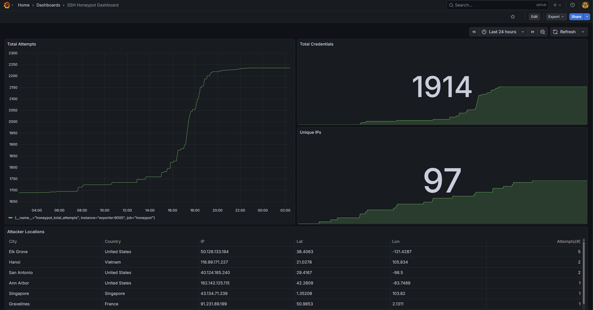

# SSH Honeypot & Threat Intelligence Platform

A cloud-deployed SSH honeypot that captures real-world brute force attempts from internet-facing attackers and visualizes attack data through a live observability stack.

## Overview

This project simulates an SSH server to attract and log automated attack attempts from across the internet. Rather than using an existing honeypot tool, the SSH server is programmed from scratch using Paramiko, giving full control over what gets captured and logged. Attack data is enriched with geolocation information, stored in a SQLite database, and fed into a Prometheus + Grafana monitoring stack for real-time visualization.

## Screenshots


## Architecture

```
Internet Traffic
      │
      v
┌──────────────┐                              ┌──────────────┐
│   Honeypot   │ ───────── writes ───────── > │ connections  │
│  (Port 22)   │                              │  .db/SQLite  │
└──────────────┘                              └──────────────┘
                                                      │
                                                   queries
                                                      │
                                                      v
                                              ┌──────────────┐
                                              │   Exporter   │
                                              │  (Port 8000) │
                                              └──────────────┘
                                                      │
                                                   scrapes
                                                      │
                                                      v
                                              ┌──────────────┐
                                              │  Prometheus  │
                                              │  (Port 9090) │
                                              └──────────────┘
                                                      │
                                                   queries
                                                      │
                                                      v
                                              ┌──────────────┐
                                              │   Grafana    │
                                              │  (Port 3000) │
                                              └──────────────┘
```

### Components

| Component | Description |
|-----------|-------------|
| `honeypot.py` | Custom SSH server built with Paramiko. Accepts connections, captures credentials, enriches with geolocation, and writes to SQLite database |
| `geoip.py` | Geolocation module that queries ip-api.com to resolve attacker IPs to country, city, and coordinates. Includes in-memory caching to respect API rate limits |
| `database.py` | SQLite database module handling table creation, record insertion, and query functions |
| `exporter.py` | Prometheus metrics exporter that queries the SQLite database and exposes attack metrics on port 8000 |
| `migrate.py` | One-time migration script for moving past JSON log data into SQLite |
| Prometheus | Scrapes the exporter every 15 seconds and stores time series metrics |
| Grafana | Visualizes metrics in real-time dashboards including time series graphs and a table of attack origins |

## Features

- Custom multi-threaded SSH server with semaphore-based concurrency (up to 50 simultaneous sessions)
- Captures attacker IP, credentials attempted, SSH client banner, connection duration, and geolocation
- SQLite database storage for efficient querying and scalability
- Real-time Grafana dashboards showing total attempts, unique attacker IPs, credential patterns, and attack origins
- Fully containerized with Docker Compose for portable, reproducible deployment
- Persistent storage for database and Prometheus data across container restarts

## Tech Stack

- **Python** — Honeypot server, geolocation module, database module, metrics exporter
- **Paramiko** — SSH protocol implementation
- **SQLite** — Structured storage for connection and credential data
- **Docker / Docker Compose** — Containerization and service orchestration
- **Prometheus** — Metrics collection and storage
- **Grafana** — Data visualization
- **AWS EC2** — Cloud deployment

## Prerequisites

- Docker and Docker Compose
- AWS EC2 instance (or any Linux server with a public IP)
- Port 22 open to the internet on your server's firewall (make sure actual SSH port is configured to something else, such as 2222, to which only you have access)

## Deployment

**1. Clone the repository**
```bash
git clone https://github.com/yourusername/SSH-Honeypot.git
cd SSH-Honeypot
```

**2. Create the data directory**
```bash
mkdir -p Honeypot-Data
sudo chmod 777 Honeypot-Data
```

**3. Start all services**
```bash
docker-compose up -d
```

**4. Verify all containers are running**
```bash
docker-compose ps
```

**5. Access Grafana**

Navigate to `http://<your-server-ip>:3000` and log in with the default credentials (`admin` / `admin`). Add Prometheus as a data source using `http://prometheus:9090` and build your dashboards.

**6. Migrate existing JSON data (optional)**

If you have existing `connections.jsonl` data to migrate into the database:
```bash
docker exec ssh-honeypot_ssh-honeypot_1 python migrate.py
```

## Metrics Exposed

| Metric | Description |
|--------|-------------|
| `honeypot_total_attempts` | Total number of connection attempts logged |
| `honeypot_unique_ips` | Number of unique attacker IP addresses |
| `honeypot_total_credentials` | Total number of credential pairs attempted |
| `honeypot_attempts_by_location` | Attempts broken down by IP, country, city, and coordinates |

## Database Schema

**connections**
| Column | Type | Description |
|--------|------|-------------|
| id | INTEGER | Primary key |
| timestamp | TEXT | Time of connection attempt |
| ip | TEXT | Attacker IP address |
| port | INTEGER | Attacker source port |
| country | TEXT | Country resolved from IP |
| city | TEXT | City resolved from IP |
| lat | REAL | Latitude coordinate |
| lon | REAL | Longitude coordinate |
| client_banner | TEXT | SSH client version string |
| auth_attempts | INTEGER | Number of credential attempts |
| duration | REAL | Connection duration in seconds |

**credentials**
| Column | Type | Description |
|--------|------|-------------|
| id | INTEGER | Primary key |
| connection_id | INTEGER | Foreign key to connections table |
| username | TEXT | Username attempted |
| password | TEXT | Password attempted |

## Security Notes

- The honeypot always returns `AUTH_FAILED` — no attacker can gain access (this may be updated to simulate a full shell access in the future)
- The application runs as a non-root user inside the container
- Real SSH access to the server is on a non-standard port, restricted to trusted IPs only
- Prometheus and Grafana ports should be restricted to trusted IPs in your firewall rules
